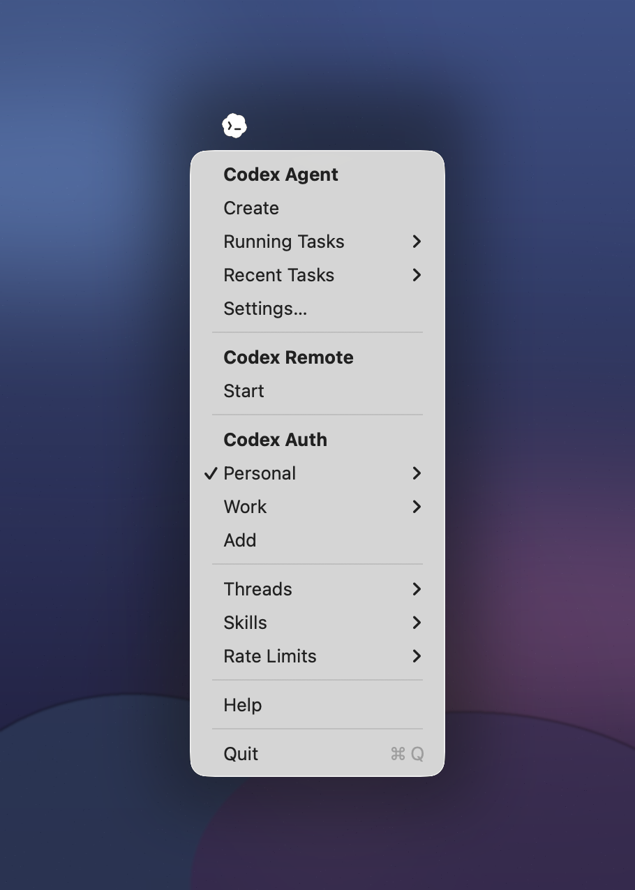

## Intro

Hello 👋 continuing with the spirit of this repo I want to use it to an AI tools, first orchestration playground.

<p align="center">
  
</p>

## Quickstart

### Install local tools from source

```shell
./install.sh
```

## Index

- [Codex Auth](./codex-auth/README.md): CLI for Codex auth profile management.
- [Codex Sessions](./codex-sessions/README.md): CLI for local Codex session lifecycle.
- [Codex Remote](./codex-remote/README.md): Telegram bridge to Codex app-server.
- [Codex Menubar](./codex-menubar/README.md): Menu bar app orchestrating local Codex tooling.
- [Codex Agents](./codex-agents/README.md): autonomous/headless agent workflow contract.
- [Overlay](./overlay/README.md): Android blackout overlay utility app.
- [Voice](./voice/README.md): Android on-device voice keyboard (ASR + rewrite).
- [Site](./site/README.md): static site content and generation.

## Harness Engineering Model

- This monorepo is harness-first: automate repetitive engineering loops with explicit contracts, bounded permissions, deterministic retries, and observable outputs.
- Reference: [Harness Engineering](https://openai.com/index/harness-engineering/).
- Practical defaults:
  - Keep each module independently runnable.
  - Prefer CLIs/scripts as stable integration boundaries.
  - Keep state explicit and recoverable.
