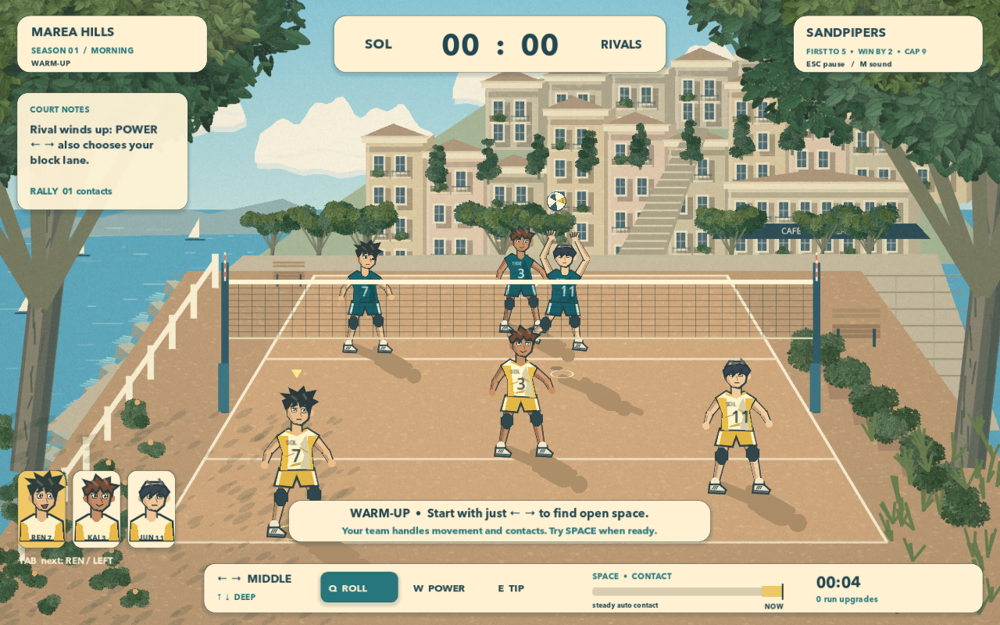

# Spike Season

A standalone Godot 4 volleyball roguelike about three teammates, coastal courts, and a summer championship. All scenery, athletes, textures, animation, effects, and audio are generated by the project. No network connection or external game assets are needed.



## Launch

Install Godot 4, then from the repository root:

```sh
godot --path games/spikeseason
```

Or open `games/spikeseason/project.godot` in Godot and press **F6** on `main.tscn` / **F5** to run the project. `./games/spikeseason/launch.sh` also locates an installed Godot executable. Runtime verification uses Godot **4.7.2**, Compatibility renderer, on macOS.

## Play

Positioning, receiving, setting, and control handoff are automatic. The gold ground ring identifies the teammate meeting the ball. Start with aim and a shot choice; contact timing is optional. Choices remain selected until changed.

| Input | Action |
| --- | --- |
| Left / Right (or A / D) | Choose left, middle, or right landing lane; also choose the defensive block lane |
| Up / Down | Deep or short placement for roll/power |
| Q | High roll: clears the block, gives defenders more recovery time |
| W | Power: quick flight, vulnerable to a committed block |
| E | Short tip: pulls deep defenders toward the net |
| Space | Start the serve toss / queue the current teammate's contact |
| Tab | Choose the other attacking route for the next set |
| Escape | Pause, resume, or leave the current run |
| M | Toggle sound |
| F12 | Save a runtime screenshot in Godot's user-data directory |

A steady automatic contact keeps the rally alive. Press Space near the end of the contact bar for a stronger contact; the broad good window helps without requiring precise timing. An excellent dig also extends the reachable save. Placement and coverage still determine whether a shot scores. A well-timed power attack can be blocked.

Read the net separately from the landing marker: an outside hitter's cross-court power can still pass through the block on that hitter's side. Roll over it, change the attacker **before the set**, or tip into uncovered front court. The court notes explain the rival's wind-up and committed block.

## The circuit

Each season is a three-match championship. Matches are first to five, win by two, with a hard cap at nine. Draft one temporary upgrade after each of the first two wins. Win the championship to permanently unlock the next season. A loss ends the attempt and clears its upgrades; all unlocked seasons remain available for replay.

| Court | Seasons | Variations |
| --- | --- | --- |
| Marea Hills | 1 First light · 2 Sea glass · 3 Golden hour | Morning, sea breeze, warm evening |
| Lantern Harbor | 4 Fair winds · 5 High tide · 6 Harbor lights | Morning, sea breeze, warm evening |
| Citrus Gardens | 7 Green canopy · 8 Summer thunder · 9 Endless summer | Morning, sea breeze, warm evening |

Choose a team identity at the start of each run:

- **Sunkeepers:** broader receiving reach.
- **Shorebirds:** quicker movement across all three teammates.
- **Fireflies:** build attacks around Jun, a faster outside finisher.

Rivals develop quicker reactions, different front/back coverage, lane memory, short-shot coverage, and more selective attacks. From High tide onward, repeated short attacks pull their wings forward; read the visible formation and attack the newly open deep court. Both teams obey bounded movement, reach, ball flight, and landing recovery. There are no random point awards, paid resources, or permanent stat grinding.

## Saving and settings

The game writes versioned `progress.json` in Godot's user-data directory using a temporary file and atomic replacement. On macOS this is normally:

```text
~/Library/Application Support/Godot/app_userdata/Spike Season/
```

Unlocked seasons, championship crowns, sound, and reduced-motion settings persist. Temporary upgrades do not carry into a new attempt. Leaving a run returns to season selection. The pause menu provides sound and motion controls; season selection also exposes them.

## Project structure

- `scripts/main.gd`: match simulation, championship flow, saves, and court rendering.
- `scripts/interface.gd`: focusable menus, coaching, score, timing, and teammate cards.
- `scripts/athlete.gd`: articulated original athletes, expressive portraits, and bounded contact poses.
- `scripts/scenery.gd`: three procedural coastal illustrations, cached into a viewport texture.
- `scripts/leaf_painter.gd`, `shaders/paint.gdshader`: locally adapted from this repository's Cozy Sora leaf rasterizer and painterly shader. There is no runtime dependency on Cozy Sora.
- `scripts/sound.gd`: synthesized contact percussion, melodic instruments, and surf.

See [VERIFICATION.md](VERIFICATION.md) for runtime evidence, independent review findings, fixes, and limits. No automated tests or gameplay bots are included.

## Optional manual review console

The console is disabled in normal play. It listens only on localhost when explicitly requested:

```sh
godot --path games/spikeseason -- \
  --review-port=45901 --review-profile=local-review \
  --capture-dir=/tmp/spike-season-captures
python3 games/spikeseason/tools/review.py --brief
python3 games/spikeseason/tools/review.py '{"action":"menu","choice":"practice"}'
python3 games/spikeseason/tools/review.py '{"action":"input","key":"tip"}'
python3 games/spikeseason/tools/review.py '{"action":"capture","name":"rally"}'
```

Each invocation sends one manual command through the normal match/menu functions. `--full` includes the rally ledger and player positions. Input keys are `left`, `right`, `up`, `down`, `roll`, `power`, `tip`, `attacker`, `contact`, and `pause`. Menu choices include `play` with a one-based unlocked `season`, `upgrade` with a zero-based offer `index`, and `leave` from pause. `speed` with `value` between 0.05 and 4 enables explicitly assisted playback. It does not change simulation rules. The console has no scoring, unlock, stat, or victory override. Review profiles use separate saves and run records.
