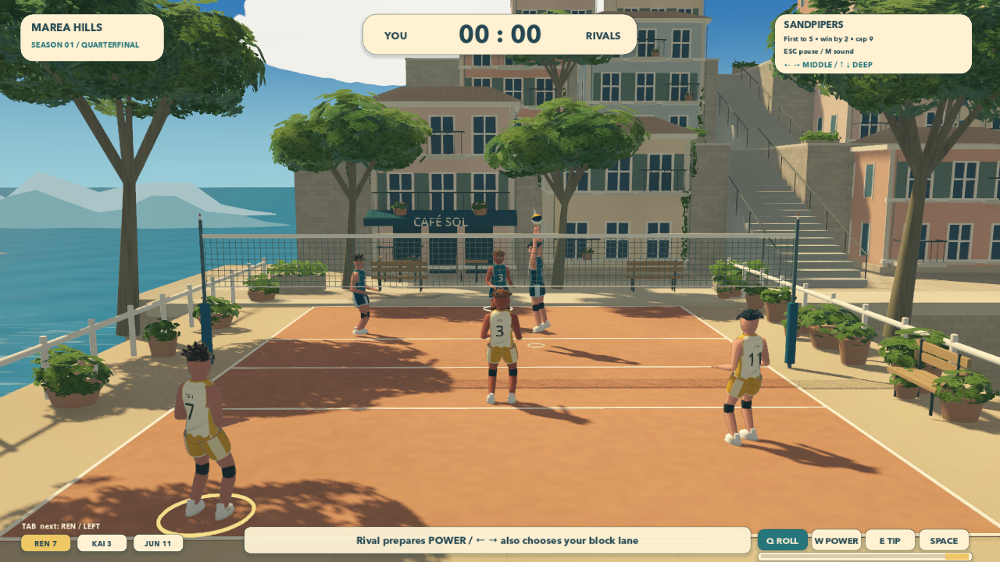

# Spike Season

A standalone Godot 4 volleyball roguelike: three friends, nine summer championships, and one more ball worth chasing. Six articulated athletes play on dimensional coastal courts under a perspective camera. Geometry, leaf textures, shaders, animation, effects, and sound are generated locally; the game needs no network or external game assets.



## Launch

Use **Godot 4.7.2** with a **Forward+** capable GPU (Metal, Vulkan or Direct3D 12). Development and desktop builds require Forward+; unsupported renderers exit before gameplay and save loading. Automatic OpenGL fallback is disabled.

```sh
godot --path games/spikeseason
```

Or run `./games/spikeseason/launch.sh`, or import `project.godot` in Godot and press **F5**. The project opens directly into the introduction. No other game directory is needed. The game runs independently of every other repository project. Startup logs report the actual renderer, driver, GPU and window size. The default window is **1280×720**, with a **1440×810** logical UI canvas and a 60 FPS cap.

## Play

Your teammates position themselves, pass, set, and hand control to the next player automatically. The gold ring follows the teammate meeting the ball. Start by choosing a lane and a shot; contact timing is optional. Choices stay selected until you change them.

| Input | Action |
| --- | --- |
| Left / Right or A / D | Choose the landing lane and defensive block lane |
| Up / Down | Deep or short placement for roll and power |
| Q | High roll: clears the block, allows more defensive recovery |
| W | Power: faster flight, vulnerable to a waiting block |
| E | Tip: short placement that makes deep defenders travel |
| Space | Start the serve toss or queue the current contact |
| Tab | Choose another hitter for the next set |
| Escape | Pause or resume; pause menu includes leaving the run |
| M | Toggle sound |
| F12 | Save a gameplay screenshot in Godot's user-data directory |

A steady automatic contact keeps reachable balls in play. Space near the end of the timing bar improves contact; a broad good window helps without requiring precision. An excellent dig extends reachable saves, and pass/set quality carries into the attack. Excellent timing cannot rescue every unreachable ball or beat a committed block automatically.

Read the hitter route as well as the landing marker. An outside hitter's cross-court power can meet the block on the hitter's side. Roll over it, tip into space, or change the hitter **before the set**. Late rivals keep one wing deep when short shots pull the other forward and remember repeated hitter routes. Their commitments create visible openings; they do not teleport or read a new shot choice after committing.

## The circuit

Every season is a three-match championship: first to five, win by two, capped at nine. Draft one temporary upgrade after each of the first two wins. A championship permanently unlocks the next season. A defeat clears the attempt's upgrades. Earned seasons and crowns remain available for replay.

| Venue | Seasons | Atmospheres |
| --- | --- | --- |
| Marea Hills | 1 First light · 2 Sea glass · 3 Golden hour | Summer morning, cool bright sea light, warm evening |
| Lantern Harbor | 4 Fair winds · 5 High tide · 6 Harbor lights | Sunny quay, cool high tide, peach dusk and lanterns |
| Citrus Gardens | 7 Green canopy · 8 Summer thunder · 9 Endless summer | Leaf-filtered sunshine, soft overcast, golden late summer |

Each venue has its own geometry. Its three seasons reuse that geometry with lighting, sky, water tint, and synthesized ambience changes. Weather is atmospheric and does not add hidden ball forces.

Choose **Sunkeepers** for more receiving reach, **Shorebirds** for quicker team movement, or **Fireflies** for Jun's faster outside finish. Drafts offer attack, placement, timing, recovery, scouting, and teamwork choices. There are no permanent statistical upgrades or required grinding.

## Saving and settings

Versioned progress is written through a temporary file and atomic replacement. Crowns, unlocks, sound, and reduced motion survive restart; unfinished attempts do not. On macOS the normal save is:

```text
~/Library/Application Support/Godot/app_userdata/Spike Season/progress.json
```

Menus support mouse and keyboard focus. Reduced motion removes ball trails and contact pulses; the framing camera still follows deep court coverage, and athlete/scenery animation remains. Sound and motion settings are available in season selection and pause. Review profiles use separate saves and do not alter normal progress.

## Source ownership

- `scripts/main.gd`: fixed-step match simulation, tactics, championship flow, and saves.
- `scripts/interface.gd`: focusable menus, coaching, score, optional timing, and compact teammate cards.
- `scripts/three_d/presentation.gd`: camera, court, net, lighting, seasonal variation, and world/HUD projection.
- `scripts/three_d/athlete.gd`: sculpted original heads, jerseys, articulated limbs, planted gait, action anticipation, hand contact, and landing.
- `scripts/three_d/coast.gd`, `harbor.gd`, `gardens.gd`: dimensional procedural venues; harbor/gardens reuse the local scenery construction helpers.
- `scripts/three_d/geometry.gd`, `ball_effects.gd`, `shaders/three_d/`: meshes, materials, print color finish, wind, water, and contact feedback.
- `scripts/leaf_painter.gd`, surface noise, foliage, and paint techniques: adapted from this repository's Cozy Sora. No runtime dependency on that project remains.
- `scripts/sound.gd`: synthesized percussion, melody, surf, mooring bells, and garden ambience.

See [Forward+ migration and verification](FORWARD_PLUS.md) for matched views, feature decisions, performance, independent reviews and limits. [Previous 3D iteration findings](VERIFICATION.md) remain a historical record. No automated tests or gameplay bots were created. The supplied art reference is not included as an in-game image.

## Optional manual review console

Disabled in normal play; explicitly enabled only on localhost:

```sh
godot --path games/spikeseason -- \
  --review-port=45901 --review-profile=local-review \
  --capture-dir=/tmp/spike-season-captures
python3 games/spikeseason/tools/review.py --brief
python3 games/spikeseason/tools/review.py '{"action":"menu","choice":"practice"}'
python3 games/spikeseason/tools/review.py '{"action":"input","key":"tip"}'
python3 games/spikeseason/tools/review.py '{"action":"capture","name":"rally"}'
```

Each invocation sends one manual command through normal input/menu functions. `--full` includes positions, action/contact telemetry, the rally ledger, and the last 600 wall-clock frame times. Inputs include `left`, `right`, `up`, `down`, `roll`, `power`, `tip`, `attacker`, `contact`, and `pause`. `menu` accepts `play` with a one-based unlocked season, `upgrade` with a zero-based offer index, and `leave` while paused. `speed` from 0.05 to 4 is explicitly assisted playback; `camera` is authoring inspection. Neither changes scoring rules. There are no score, unlock, stat, or victory overrides.

## Desktop export

Install the matching **4.7.2 export templates** in Godot, then run from this directory:

```sh
mkdir -p build
godot --headless --path . --export-release macOS "build/Spike Season.app"
godot --headless --path . --export-release Linux "build/Spike Season.x86_64"
godot --headless --path . --export-release Windows "build/Spike Season.exe"
```

The macOS preset creates a universal app with local ad-hoc signing; public distribution needs your own signing/notarization. Linux and Windows presets target x86_64. Headless export is packaging, not runtime verification. There is no web export or alternate-renderer build. Output folders and verification captures are excluded from game resources.

The optional console also reports actual renderer, wall-clock frame times and engine memory counters. Reset the frame sample before a manual play interval, then stop sampling and request state **before** taking screenshots:

```sh
python3 tools/review.py '{"action":"performance","reset":true,"frames":3600}'
# Play normally for the measurement interval.
python3 tools/review.py '{"action":"performance","record":false}' --full
```

`video_memory_bytes` is an engine accounting value, not total process or physical GPU memory. Use an OS process-memory measurement alongside it. Screenshot readback, movie capture, startup and venue loading should be reported separately from steady play.
