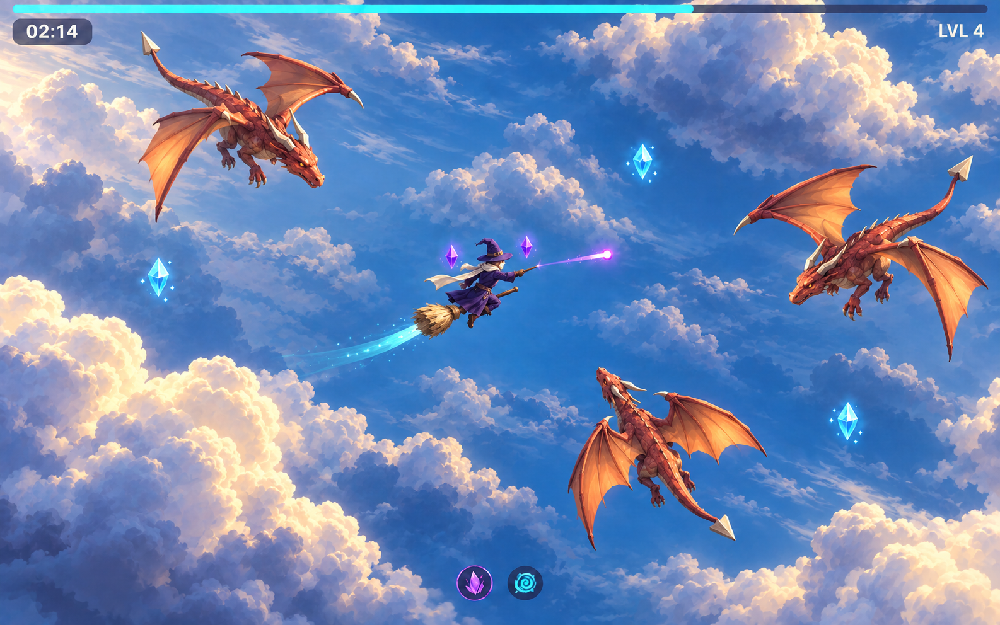

# Arcane Skies

A higher-fidelity art target developed from the selected Bold Cel direction. Generated with the built-in imagegen tool using the [mature refinement](03-bold-cel-refined.png) as the edit target. The aim is premium stylized 3D with convincing anatomy, material separation and atmospheric depth, while keeping the open procedural sky and overhead gameplay camera.

## Visual direction

An adult wizard in deep violet cloth rides a wooden broom above sculpted cloud banks. Rust-coral dragons approach on articulated wings, with warm light filtering through the thinner membranes. Ivory cloud crowns catch sunlight; shaded bellies turn cool blue and violet. Distant formations fade into a deep blue atmosphere, while local spell effects stay small and clear.

The quality target comes from shaped silhouettes and coherent light response. Dragon muscles, jaws and wing structure should carry the design. Subtle surface relief can enrich shoulders and backs without covering every surface in detail. Cloth, leather, horn and wood should have distinct material responses. Organic forms use carefully controlled smooth normals, with sharper transitions on folds, bones and ridges.

The generated result is especially successful at wing backlighting and cloud depth. It also adds more distant cloud microdetail than a gameplay prototype should initially use. Preserve the broad light-and-shadow structure, reduce small background lobes and wisps, and check that moving enemies and shots remain easy to track.

## Candidate techniques for a prototype

| Visual gain | Procedural implementation to explore |
| --- | --- |
| Convincing creature form | Shaped cross-section meshes for torso, neck, limbs and tail; explicit wing skeleton and triangulated membranes; selective smooth normals and geometric accents. |
| Richer material response | Vertex-color gradients, a few material roughness ranges, low-frequency procedural normal variation, restrained specular response and colored lighting. |
| Sunlight through wings | A custom backlighting term controlled by light direction and a thickness mask, with opaque bones and roots. This approximates the appearance without requiring a full scattering simulation. |
| Luminous cloud volume | Joined field-generated meshes, broad wrapped lighting, underside occlusion and a thickness-dependent edge-light term. A limited layer of depth-faded vapor can be evaluated separately. |
| Strong atmospheric depth | Three cloud depths with progressively quieter contrast and color, a continuous world-space atmosphere and modest distance haze below the combat plane. |
| Focused magic | Tapered geometry ribbons, emissive cores and bounded small particle effects, keeping the brightest areas close to each spell. |

These are implementation candidates, not measurements or verified renderer features of this project. The current actor shader uses matte diffuse shading and the current cloud shader is unshaded with normal-based color mixing; reaching this target requires new modeling and material work.

## Procedural-world constraints

Each cloud must belong to a reusable deterministic shape family. Use stable world coordinates for shape selection and variation, then stream shared meshes in a bounded neighborhood. Vary broad silhouettes, scale and depth without turning each chunk into a unique artwork. Detail levels and cloud material cost should be tested while the camera moves and actors accumulate.

Keep the sky continuous beyond every edge. Do not rely on fixed cloud borders, landmarks, a painted panorama or a permanent central clearing. Clouds remain below the flight plane and never hide the wizard. The image's specific arrangement is illustrative; world generation must preserve readability across arbitrary positions and revisits.

A practical first prototype is one well-shaped dragon, the wizard and a small cloud family under a coherent light rig. Judge it at the current camera scale before adding fine surface detail. Verify streaming transitions and frame time before choosing the final cloud effects.

This is an aspirational generated image, not an implemented game screenshot or performance promise. No gameplay code or current art settings were changed.

[Full image-generation prompt](03-arcane-skies-prompt.txt)
