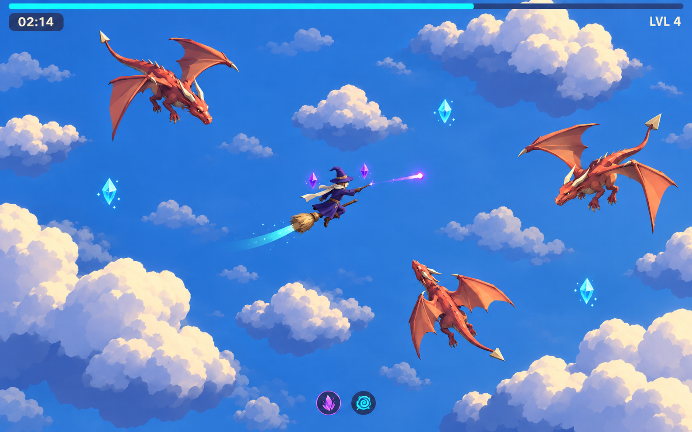

# Bold Cel, refined

A more mature development of the user's selected third direction. “Duopl” was interpreted as **low poly**: shaped 3D meshes with controlled polygon detail, softened cel shading and believable proportions. Generated with the built-in imagegen tool using the [original Bold Cel image](03-bold-cel.png) as the edit target.

## Direction

Keep the original's clear violet hero, warm-colored dragons and open blue sky. Give the wizard adult proportions and more convincing clothing, and give the dragons narrow heads, muscular bodies and articulated wings. Replace heavy comic outlines with depth from directional lighting, broad shadow bands and restrained material differences.

The target is stylized realism at gameplay scale. Spend geometry on the hat, scarf, wing structure and creature silhouettes. Use a few broad modeled folds and ridges instead of intricate textures. Keep the clouds wind-shaped and airy, with joined masses and flattening undersides.

## Building the look with code

- **Characters:** custom procedural meshes assembled from shaped cross-sections for bodies, limbs, tails and cloth, with explicit horns, wing bones and triangulated wing membranes. Shared meshes and materials can support multiple actors; convincing anatomy still requires deliberate modeling work.
- **Materials and light:** vertex colors, a small set of roughness values, a directional light and a shader with a few broad, softened lighting bands. Selective smooth normals keep organic surfaces from looking like rocks. Subtle outlines are optional.
- **Endless sky:** reuse a bounded family of cloud meshes across the existing three parallax layers, with coordinate-seeded variation in shape, scale, rotation and placement. Use continuous atmospheric color rather than a unique panoramic painting or fixed landmark. Cloud clusters remain decorative below the flight plane.
- **Effects:** short geometry ribbons, simple crystal meshes and restrained emission preserve the contrast of the combat actors.

This image is an aspirational reference, not a verified rendering or performance result. A code prototype should first validate one wizard, one dragon and a cloud family at the current gameplay zoom, then check motion and streaming. No game code or current art settings were changed.

[Full image-generation prompt](03-bold-cel-refined-prompt.txt)
