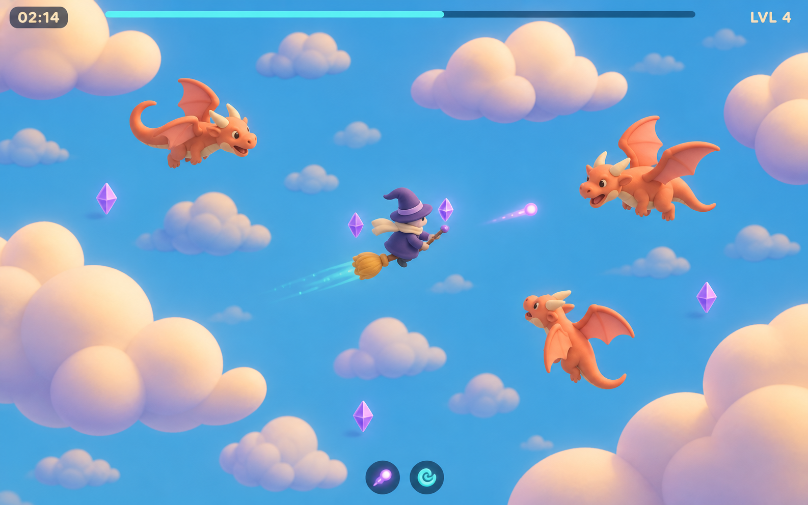
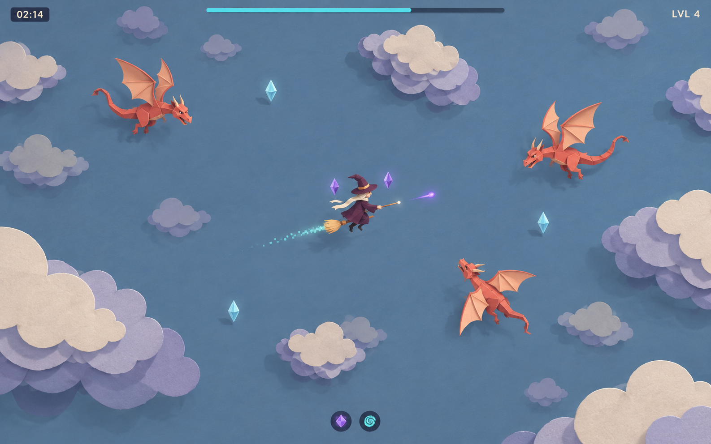
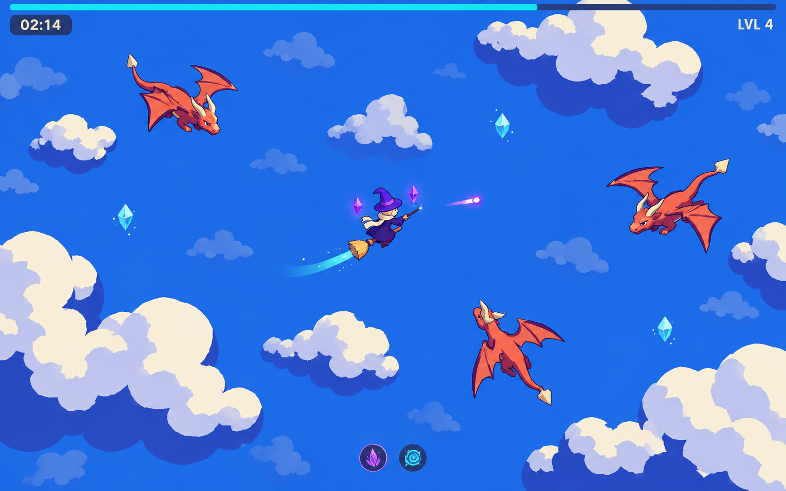
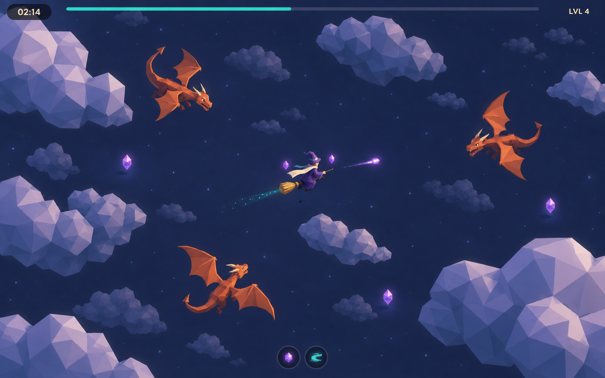

# Four looks for an endless procedural sky

Visual proposals for Wiz 'n' Dragons, September 10, 2026. Generated with the built-in imagegen tool. Each image explores a different treatment of characters, clouds, materials and lighting. They are concept frames, not runtime assets or verified seamless textures.

All four share the game's elevated orthographic camera, broom-riding wizard, small dragons and open flight plane. The world must continue beyond every edge as new areas stream in. The concepts therefore use scattered cloud clusters and a continuous atmosphere instead of a fixed landmark, horizon or enclosing arena.

## 1. Soft Clay

A compact purple wizard flies through a bright azure sky among smooth ivory cloud masses. Rounded orange dragons, a broad hat, golden broom bristles and an oversized cream scarf create a cheerful miniature look. The forms are soft and simple, with most detail coming from light and silhouette.

**Procedural approach:** build a small family of joined cloud meshes with a few broad lobes and tapered ends. Vary their outline, rotation and scale within limits. Use matte materials and shared meshes for characters and clouds; reduce contrast across the three cloud depths. This is closest to the existing miniature approach while giving it a brighter, friendlier identity.

[Full image prompt](01-soft-clay-prompt.txt)

## 2. Layered Paper

The wizard, broom and dragons become folded paper miniatures. Cream cloud cutouts overlap muted lavender layers above a dusty blue sky. Shallow edges, simple folds and restrained offset shadows provide depth without dense surface detail.

**Procedural approach:** generate each cloud as a small stack of shallow extruded polygon silhouettes. Keep the stack inside one cloud module so it can be placed and removed independently. Use a consistent light direction and layer offsets across modules, with restrained rotation so the paper thickness remains coherent. This offers the strongest handmade identity, but needs a larger change to the current geometry style.

In the generated frame, some drop shadows flatten the sense of altitude. In a prototype, keep shadows local to the paper layers and use parallax to establish the open space below the actors.

[Full image prompt](02-layered-paper-prompt.txt)

## 3. Bold Cel

A violet wizard and coral dragons stand out against a cobalt sky. Broad ivory clouds have sharply separated blue-violet shadow bands. Thin outlines, chunky silhouettes and a few clean magical strokes give the scene a graphic arcade quality.

**Procedural approach:** use simple reusable meshes with two-tone shading. Reserve outlines and strong contrast for actors and nearby clouds; simplify distant clouds into desaturated shapes. Keep shadow thresholds and outline widths consistent as objects load. This is the strongest candidate for fast combat readability and a practical direction to prototype with the current geometry-and-shader pipeline.

[Full image prompt](03-bold-cel-prompt.txt)

[More mature refinement of this direction](03-bold-cel-refined.md): believable proportions and richer 3D lighting with procedural meshes and softened cel shading.

[Arcane Skies](03-arcane-skies.md): a higher-fidelity target exploring material response, wing backlighting, sculpted clouds and atmospheric depth.

## 4. Moonlit Low Poly

An indigo night sky holds angular lavender cloud banks, a small violet wizard and copper-orange dragons. Broad facets catch cool light, while a pale scarf and restrained turquoise and violet magic bring small points of brightness to the scene.

**Procedural approach:** use coarse cloud meshes with hard normal transitions and a limited material palette. Vary sweeping outlines more than individual triangle detail. Keep atmospheric color and light direction stable across chunks, and keep actor values brighter than the background. This offers a quieter, more mysterious identity with simple reusable geometry; combat visibility needs special attention in the darkest areas.

The cloud facets in this frame lean toward stone. A prototype should soften the silhouette and reduce facet contrast while preserving the angular material treatment.

[Full image prompt](04-moonlit-low-poly-prompt.txt)

## Rules that make the look work while exploring

- Treat each frame as a crop of a continuing world. Avoid placing decoration relative to screen corners or designing a permanent cloud ring around the player.
- Use the seed and world coordinates to select module shape and placement, so an area has a stable appearance on revisits. Use world-space sampling for any broad atmospheric variation.
- Preserve the existing three cloud depths and bounded streaming caches. Load modules outside the visible area and verify that they are present before camera movement exposes them.
- Create variety through several silhouette families, spacing, size and orientation. Avoid relying on a unique painting for every chunk or repeating one recognizable cloud at a regular interval.
- Keep decorative clouds below the flight plane and maintain quiet space around combat. Atmosphere can fade with distance; actors and projectiles need clear contours.
- Compare prospective implementations at the current camera scale during travel, revisits and a crowded fight. A generated still does not validate streaming transitions, frame time or readability in motion.

The current cloud system already uses eight shared mesh variants, three parallax depths and coordinate-seeded placement. These proposals adapt that structure. No game code or current art settings were changed for this exploration.
