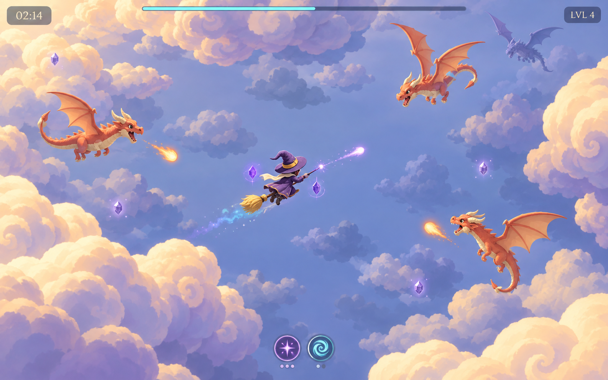

# Sunlit Spellbound Sky

Proposed visual direction for Wiz 'n' Dragons, reviewed September 10, 2026. This is a generated concept reference; it does not represent an implemented game change. Generated with the built-in imagegen tool. The [full generation prompt](sunlit-spellbound-sky-prompt.txt) accompanies the concept.

## Review of the current games

**Boats 'n' Beasts:** the quiet teal water gives the warm sand, green foliage, dark rocks and compact actors distinct visual roles. Broad matte shapes stay readable at the normal overhead camera scale. The island silhouettes and shore transitions give the scene structure without covering the open movement space. This separation is the strongest principle to carry into Wiz 'n' Dragons.

**Wiz 'n' Dragons:** the bent wizard hat, broom, cream scarf and coral dragons already establish the theme. The current background fills much of the frame with similar blue-gray values and mottled cloud texture. Large cloud banks have similar elongated silhouettes, while some near and far clouds have comparable contrast. This makes the atmosphere feel heavy and depth harder to judge. The dragons would benefit from broader wings and stronger differences in silhouette; their small faces cannot do all the work at gameplay scale.

## Proposed direction

Build a bright storybook sky from matte painted miniatures. Use a calm periwinkle flight area, warm ivory cloud crowns and lavender undersides, with progressively softer, less saturated clouds below. Give each cloud bank a few large, joined billows and an irregular sweeping silhouette. Keep the area immediately around combat quiet.

Give the wizard a rich plum silhouette, an oversized bent hat, an ivory scarf and a clearly separated golden broom tail. Keep coral dragons distinct against the cooler atmosphere, using broad scalloped wings, curved tails and ivory horns. Distinguish enemy families through body and wing proportions as well as color. Friendly magic remains violet or turquoise; hostile spell effects remain coral.

Retain the elevated orthographic camera and modest character scale. The image explores lighting, palette, silhouettes and cloud depth. Its enemy arrangement and HUD values are illustrative. Judge any future implementation in a moving scene at the current gameplay zoom; clouds remain decorative and do not obstruct flight.

The generated image is more illustrative and detailed than the intended procedural rendering, especially in its cloud edges and dragon anatomy. Carry over the broad shapes and color separation, simplify the fine painted detail, and validate actor sizes at the existing gameplay camera scale.

| Visual role | Proposed color |
| --- | --- |
| Open sky | Cornflower / periwinkle `#778EC0` |
| Cloud undersides | Atmospheric lavender `#9E9BC8` |
| Cloud crowns | Warm ivory `#FFF0CF` |
| Sunlit edge accents | Soft peach `#F4D0AD` |
| Wizard | Plum `#65416F` with ivory and gold |
| Dragons / hostile effects | Coral `#DE704E` |
| Friendly effects | Violet and turquoise |

These swatches express the proposed palette; they are not sampled measurements of the generated image.

## Image description

A small broom-riding wizard flies through an opening between sunlit cloud banks, viewed from the game's elevated overhead perspective. A bent plum hat, flowing ivory scarf and golden broom bristles give the hero a compact, recognizable silhouette. Violet spell crystals and a restrained turquoise trail suggest movement and magic.

Coral dragons with ivory horns and broad wings approach across the cool blue sky. Warm cream cloud tops turn to lavender underneath, while smaller, softer formations recede below the action. The scene feels airy and playful, with clear space around the characters and a small, understated HUD.

## Runtime references and scope

Both projects were launched using their existing `run.command` launchers. Both Debug builds completed with zero warnings and errors, using Godot 4.7.2 .NET and Forward+ / Metal. Fresh F12 captures were inspected at native gameplay scale:

- [Boats 'n' Beasts](boats-current.png), with [paired telemetry](boats-current.txt): 33.7 seconds of active sailing, level 1, four kills.
- [Wiz 'n' Dragons](wiz-current.png), with [paired telemetry](wiz-current.txt): 79.7 seconds of active flight, Ember, level 3, ten kills.

This was a visual review of short live sessions and relevant presentation code, not a full gameplay, balance or performance audit. No gameplay code or current art settings were changed. A future implementation should continue to use C#/Godot geometry and shaders, with the concept serving as a visual reference.
