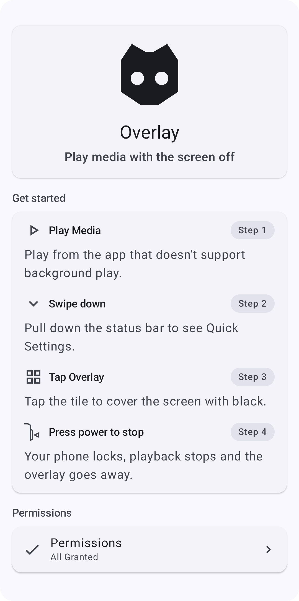
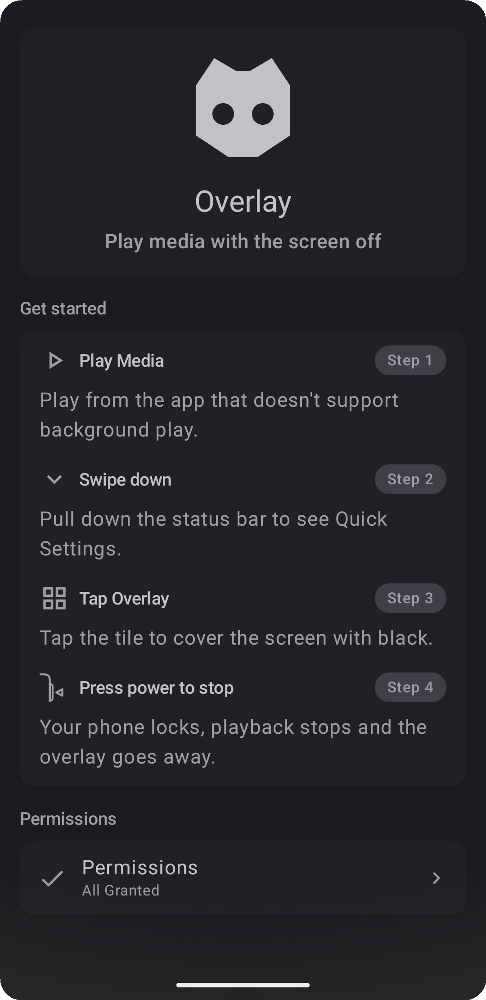

## Intro

**Overlay** is a small Android app for a common issue: some media apps did not implement background play and stop when you lock the phone, so you lose audio the moment the screen goes off.

Start playback, tap the Overlay tile, and lock your screen; Overlay keeps a black layer on top so audio can continue, can reduce battery use on OLED displays compared with leaving bright content visible, and helps prevent accidental taps while your phone is in your pocket.

  
  &nbsp;&nbsp;&nbsp;&nbsp;&nbsp;&nbsp;
  

