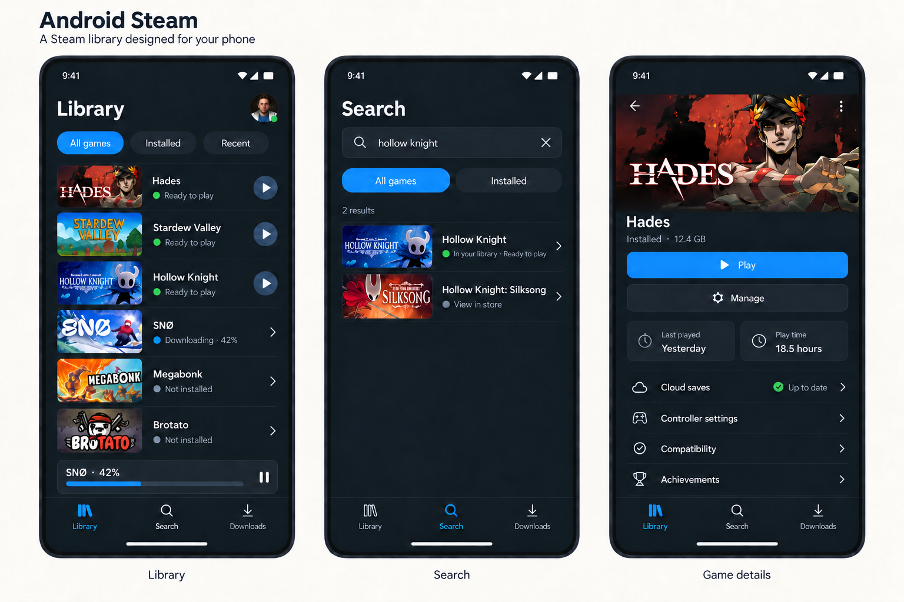

# Android Steam

An Android 16+ app being built to run Linux, Steam's Deck interface, and Proton games locally without root. The existing Steam session, owned-game interface and Superflight, Brotato and SNØ gameplay with digital touch controls were validated on the Samsung S24 (SM-S921U1, Adreno 750). Game audio reaches Android output. The native library, search, details and per-game settings use the phone’s Steam data; broader game compatibility remains unverified.

The frontend uses Kotlin and Views/XML. Steam owns authentication, licenses, client updates, and game downloads. Android Steam presents the native library and launch settings. The initial scope is one ARM64 Adreno device; desktop apps, emulators, external game imports, and frame generation are excluded.

Mobile interface concept:



## Build and try

Use JDK 17 or 21, SDK 36, NDK `28.2.13676358`, and CMake `3.22.1`. Set `ANDROID_HOME` or `sdk.dir` in `local.properties`. Native builds need macOS Command Line Tools or Linux `build-essential libexpat1-dev zstd patch`, plus the usual Bash/curl/archive tools.

```sh
./gradlew :app:assembleDebug
adb install -r app/build/outputs/apk/debug/app-debug.apk
```

Open Android Steam and choose **Profile → Setup → Download**, then **Start Steam**. Download prepares the pinned Arch base (156 MiB), matched graphics, audio/session components and Valve’s client; allow several GB of internal storage. Its ongoing notification supports cancellation, and retry keeps completed components. Steam sign-in is still required for account-dependent prerequisites and games. **Test Linux runtime** verifies command execution. Both minimum and target SDK are 36; the packaged PRoot loader executes Linux programs, with user home stored separately from replaceable runtime files.

Choose **Open Steam** and complete Steam’s own sign-in screen on the device. Existing Steam sessions are preserved. Fresh sign-in through this screen is awaiting device validation. Return with the **Library** icon and tap **Refresh library**. The local client supplies available licenses; cached metadata/artwork and installed files do not establish ownership. Free/shared licenses can appear, and the last license-check time is shown for offline browsing. **Library**, **Search** and **Downloads** show games, actual manifest state and cached play history. Steam manages installs, updates, cloud status and achievements. You can switch apps during authentication and return through Android Steam's ongoing notification. **Stop Steam** in the ongoing notification ends the session. Use touch to navigate and type with Steam’s onscreen keyboard, which opens when selecting search. USB/Bluetooth keyboards and mice use the Android input bridge. Linux game audio plays through Android AudioTrack and mutes while the session is hidden.

During a game, tap the small gamepad icon to choose **Direct touch**, **Arrow keys** or **WASD**, saved separately for that game. The keyboard layouts add a movement stick and Escape/Space/Enter buttons. **Game settings** can add up to four P/R/Ctrl/Shift/C/X touch keys; modifier buttons can be held with movement. Android controller left-stick/D-pad and A/B/X events map to the same digital keyboard controls; analog Xbox emulation and right-stick aiming are unsupported. Controller events passed Linux integration checks; a physical gamepad has not been tested.

Steam prompts to install **Proton Experimental (ARM64)** when it is missing (about 475 MB download / 1.94 GB installed). For a Windows game, select **Android Steam Proton (ARM64)** under its **Properties → Compatibility**. The small tool runs Valve's Steam-managed ARM64 depot directly and excludes the native overlay from Wine to avoid the reproduced Steam IPC crash on relaunch. Other Proton versions and arbitrary game compatibility are unverified.

**Game settings** on a game’s detail page edits its Proton choice, arguments, environment (`NAME=value` per line) and controls before launch. **Play** starts or reuses one Steam session; changed launch settings restart an idle client before launching. Close an active game before launching another. Exiting a game opened through Play returns to native details. **Manage in Steam** keeps required prompts and Steam’s own controls accessible. For Superflight, choose **Android Steam Proton (ARM64)**, **Arrow keys**, and arguments `-force-d3d11 -screen-width 1280 -screen-height 720 -screen-fullscreen 1`. Brotato uses the same tool, **WASD**, and `--video-driver GLES2`; startup currently takes minutes. SNØ uses the same tool and **WASD**, no extra arguments, and optional **P** for photo/pause and **R** for retry. Switch to **Direct touch** when the movement overlay covers menu buttons. The app preserves unrelated Steam configuration. A listed Linux build does not establish that its native execution path works on Android; Steam default/native paths are marked unverified. Complex custom launch commands remain editable in Steam.

## Runtime updates

The Linux base is an Arch ARM snapshot assembled from `native/runtime/seeds.txt` and its checksum-pinned dependency lock. It excludes the generic image’s kernel/firmware, development outputs and manuals; required resources, licenses and package provenance remain. Steam, games and saves live in a separate home directory.

To update, run `python3 native/runtime/update.py`, review the package/source diff, then `bash native/runtime/build.sh /tmp/androidsteam-runtime`. The build needs Python 3, XZ, and a case-sensitive filesystem; on macOS set `TMPDIR` to a case-sensitive APFS volume. Retain the verified package cache because Arch's rolling mirrors can remove older versions. Validate the bundle and the Steam/game baseline on the S24, publish a new fixed release, and update `RuntimeInstaller`’s version, URL, byte count and SHA-256. Installation checks the staged runtime before replacement and recovers an interrupted swap. Users receive the tested bundle through app updates.

## Checks

```sh
./gradlew :app:testDebugUnitTest :app:lintDebug :app:assembleDebugAndroidTest
adb install -r app/build/outputs/apk/androidTest/debug/app-debug-androidTest.apk
adb shell am instrument -w -e verifySteam true -e verifySession true -e verifyVulkan true -e verifyInput true -e verifyAudio true \
  com.sanogueralorenzo.androidsteam.test/androidx.test.runner.AndroidJUnitRunner
```

Device checks require an installed runtime and the supported USB-connected S24. Optional `verifyLibrary` checks live licenses and offline browsing; `verifyProfileRestart` with `profileAppId` checks native Play after an idle-client settings change. `verifyProfiles` with `profileAppId` checks saved configuration projection. Optional `verifySetup`, `verifyDisplay`, and `verifyGraphics` arguments enable complete setup downloads/retry, shared-memory display, and driver installation checks. Downloads are opt-in. `verifyRuntimeSnapshot` tests a checksum-matching `/data/local/tmp/androidsteam-runtime.tar.xz` in a separate validation directory, including replacement, cancellation, failure and recovery. Gradle's connected test task uninstalls the app afterward; use the ADB runner above to retain user data.

See [THIRD_PARTY.md](THIRD_PARTY.md) for source pins/licenses, [docs/validation.md](docs/validation.md) for the working game configuration and measurements, and [PLAN.md](PLAN.md) for the current reliability scope.
