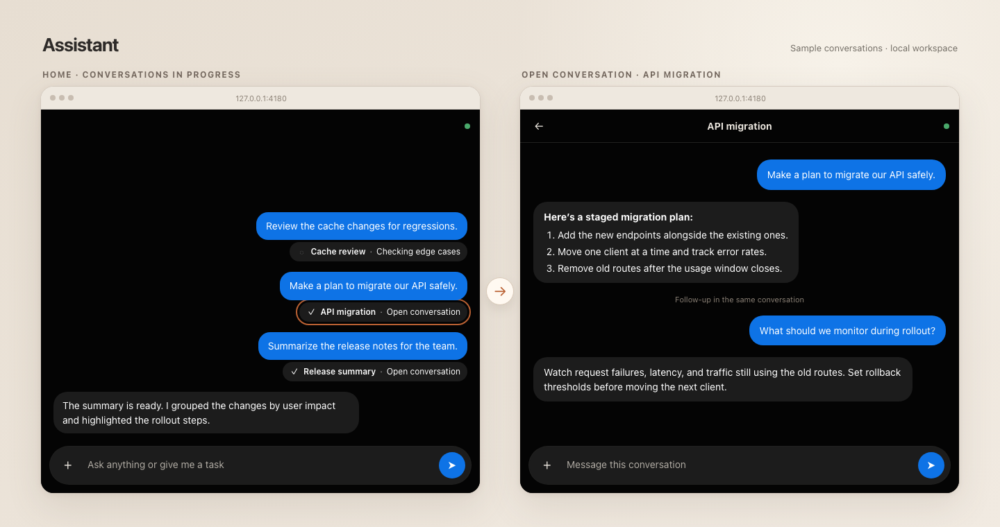

# Assistant



Assistant is a local assistant built on Pi. Home routes new requests and follow-ups to persistent session agents, which can delegate read-only research or review. Its Node service keeps conversations and queued work running when the browser closes. Open `http://127.0.0.1:4180`.

## Agentic foundations

The aim is a production-grade agentic system built on five patterns:

1. **Tool use:** choose when to call tools and incorporate their results.
2. **Reflection:** a generator produces output; an evaluator scores and critiques it against the goal; revise until it passes.
3. **Planning and task decomposition:** break complex goals into tasks and alternate reasoning with action.
4. **Orchestrator and workers:** delegate focused tasks to specialized agents, each with a narrow role and its own context.
5. **Memory and context management:** retain useful state across steps and sessions without carrying irrelevant history.

## Start

Requires Node 26+ and a signed-in Codex CLI account in `~/.codex/auth.json`.

```bash
cd tools/assistant
npm ci
npm start
```

Install Codex Computer Use in the desktop app for native app control. Assistant automatically accepts Computer Use approval requests. Use `service/install.sh` to start Assistant after login on macOS, and `service/uninstall.sh` to remove the service. Home and session state live in `~/.assistant/sessions.db`; Pi transcripts live in `~/.assistant/sessions`. Run `npm run check` for the TypeScript check.
