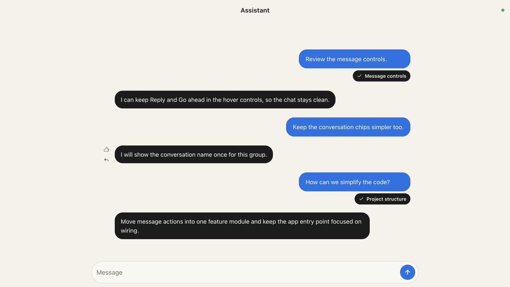

# Assistant



Assistant is a local assistant built on Pi. Home routes new requests and follow-ups to persistent session agents, which can delegate read-only research or review. Its Node service keeps conversations and queued work running when the browser closes. Open `http://127.0.0.1:4180`.

Hover over an assistant reply on Home or inside a session. Reply quotes that specific message as context; thumbs-up sends “Yes, go ahead.” A 👍 in the hover controls confirms it was sent. Controls are also available on keyboard focus and touch screens.

Canceling a quote keeps your draft. On Home, unquoted messages are routed automatically; inside a conversation, messages stay there with or without a quote.

## Start

Requires Node 26+ and a signed-in Codex CLI account in `~/.codex/auth.json`.

```bash
cd tools/assistant
npm ci
npm start
```

Install Codex Computer Use in the desktop app for native app control. Assistant automatically accepts Computer Use approval requests. Use `service/install.sh` to start Assistant after login on macOS, and `service/uninstall.sh` to remove the service. Home and session state live in `~/.assistant/sessions.db`; Pi transcripts live in `~/.assistant/sessions`.

Run `npm run check` for TypeScript and `npm test` for the focused tests.

Run `npm run eval:suggestions` to compare Luna 6 Low and High on 12 prepared follow-up cases, twice each. It makes 48 tool-free model requests and saves timings, suggestions, and token usage under the repository's `.precedent/assistant-suggestions` directory. Pass `-- heldout.json 1` for one pass over six additional cases, `-- cases.json 2 off,low` to compare no reasoning with Low, or `-- tricky.json 2 off,low,high` for 108 requests covering conflicting instructions, misleading summaries, quoted injections, and missing inputs. `off` sends native reasoning effort `none`.
