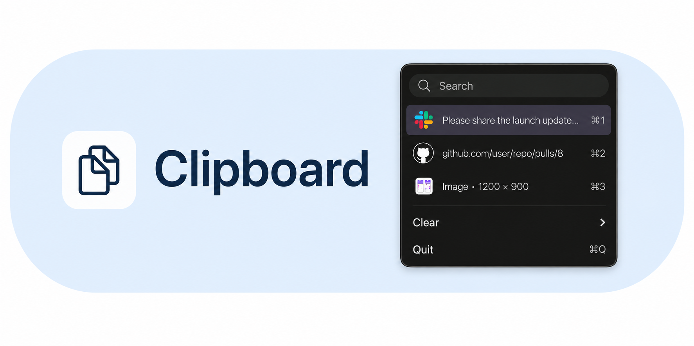

# Clipboard



A small macOS clipboard menu for text, links, images, and files. History stays encrypted on your Mac and survives restarts.

**Install or update** from the latest `main` (macOS 13+ and Xcode Command Line Tools):

```sh
curl -fsSL https://raw.githubusercontent.com/sanogueralorenzo/sanogueralorenzo.github.io/main/tools/clipboard/install.sh | sh
```

Installs in `~/Applications` and preserves your history and settings.

**⌥⇧V** opens Clipboard · **Click** copies · **Space** previews images or opens links. Click the search field to filter clips. Paste with **⌘V** in your destination app.

The header above search shows the Clipboard title and its opening shortcut.

**Clear** sets expiration. **Now** clears saved history and the current clipboard. Defaults: 200 clips, 7 days.

Links fetch icons directly from the website, with the browser icon as fallback. Only the site root and icon URLs are requested; icons are cached in memory.

Local development: `./build.sh` · Fast checks: `./tests/run.sh` · Coverage report: `./tests/run.sh --coverage` (history, formats, and website icons tested; UI untested).
