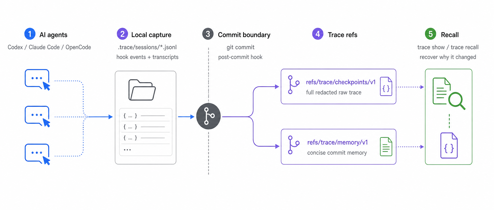

# Trace



Trace is a Go CLI prototype for repository memory. It records why a commit
changed, not just what changed.

The core workflow is:

```text
conversation + diff -> raw checkpoint on refs/trace/checkpoints/v1 + concise memory on refs/trace/memory/v1 -> recall
```

Trace captures agent hook events locally while you work. When you commit, it
writes a full redacted checkpoint record to a Trace-owned Git ref and a concise
memory note to a separate Trace-owned memory ref. Your normal branch stays
focused on product code.

## Install

Build or install the CLI from this directory:

```sh
go install .
```

Then run Trace inside any Git repository you want to remember:

```sh
trace enable
```

`trace enable` is the main setup command. It initializes `.trace/`, installs the
Git `post-commit` hook, and wires supported agent hooks where possible.

Trace does not install, wrap, or manage agent runtimes. Codex, Claude Code, and
OpenCode must already be installed for rich conversation capture. If one is
missing, Trace reports the limitation and keeps the commit-message/diff fallback
active.

## Usage

1. Run `trace enable` once in a repository.
2. Work normally with Codex, Claude Code, OpenCode, or no agent at all.
3. Commit normally with `git commit`.
4. Trace writes:
   - full checkpoint JSON to `refs/trace/checkpoints/v1`
   - concise memory markdown to `refs/trace/memory/v1`
5. Recover context later:

```sh
trace show HEAD
trace recall "why did we change auth"
```

## Command Reference

- `trace init` creates `.trace/` storage in the current Git repository.
- `trace enable` runs `init`, installs the `post-commit` Git hook, and writes hook config for Codex, Claude Code, and OpenCode.
- `trace show <commit>` prints the memory note from `refs/trace/memory/v1`.
- `trace recall <query>` searches committed memory notes.

## Layout

- `.trace/sessions/<agent>/<session>.jsonl`: local raw agent hook events before commit.
- `refs/trace/checkpoints/v1:<checkpoint>/checkpoint.json`: full redacted checkpoint record, including diff and captured sessions/transcripts.
- `refs/trace/memory/v1:<sha>.md`: concise reviewable memory note for a commit.

## Hook Surface

Trace keeps the integration surface intentionally small:

- Codex project hooks in `.codex/hooks.json` for `SessionStart`, `UserPromptSubmit`, `Stop`, and `PostToolUse`.
- Claude Code project hooks in `.claude/settings.json` for `SessionStart`, `SessionEnd`, `UserPromptSubmit`, and `Stop`.
- OpenCode plugin hook events in `.opencode/plugins/trace.ts`.
- Git `post-commit` writes checkpoint data and memory notes.
